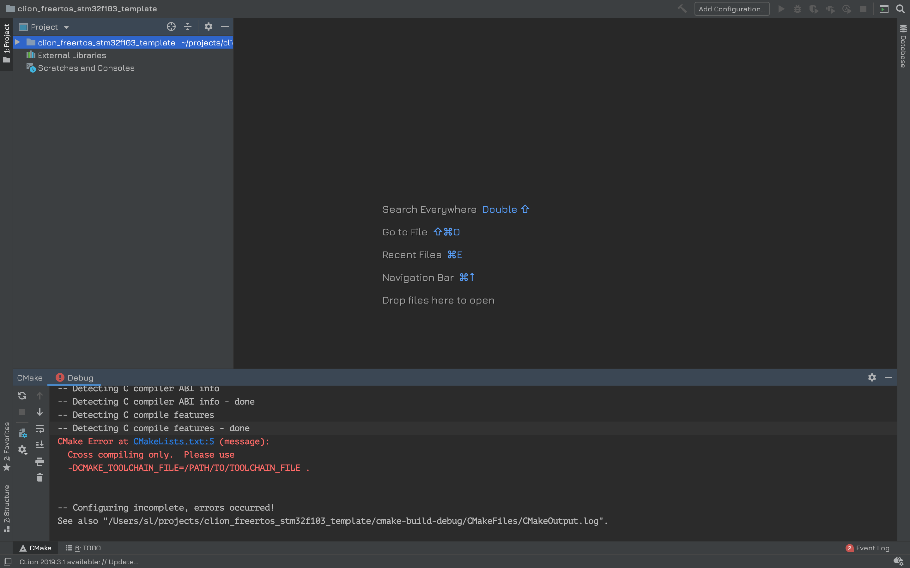

# Note

[Version for russian](./README_ru.md) speakers.

# Intro

JetBrains CLion is a great tool for developing in C / C ++. But it's based on `cmake` and I had a problem when trying to use it for microcontroller project based on stm32F10X (Cortex-M3).

For hobby purposes, I developed a small project that solves the following tasks:

- Building the [FreeRTOS](https://freertos.org/) project (10.2.x) + [libopencm3](https://github.com/libopencm3/libopencm3) in `cmake`
- Implementation of the USB stack initialization mechanism
- Implementation on the basis of [1] and [2] of the model for interviewing temperature sensors DS18B20 and BME280.
- State management.

The goal was to get a rational in terms of size, fast and convenient technological stack for various hobby tasks. I really like the libopencm3 project for its beauty, conciseness, precision and elegance.

FreeRTOS is also an example of very elegant code. By combining them together, I got the foundation for the project, and assembly under Clion allowed me to use this wonderful developer tool.

I perform debugging under the [blackmagic probe](https://github.com/blacksphere/blackmagic/wiki).

To load the example with some meaningful logic, the task of interrogating was chosen a large number of temperature sensors DS18B20 . This is a slow and time expensive operation that must be performed in parallel with the interaction interface on the USB bus.

To complicate the task, in parallel it initializes and query the BME280 sensor. Its exclusion from the project is not difficult if you don't want use it. The task was to interrogate several types of sensors in parallel and implement the user interface at the same time.

As a result, the task was to obtain an elegant and responsive device that can be connected to and controlled by any computer, interacting via the USB bus using the minicom, putty, etc programs (depending on the type of the main OS).

## Solution

An additional library was developed to solve these problems. That was able to control the OneWire protocol on USART in half-duplex mode. So, There was built additional library on the top of that for interpreting data from the DS18B20, which can be used in FreeRTOS environment (but also without RTOS). Thus, my solution allows me to control a large number of devices on the bus with a guarantee of atomic operation. I was not able to check on the quantities of more than 20 sensors, because I could not find such a number of sensors. But there is an opinion that on the same bus several dozens of devices can be located without harming the functionality and simultaneous processing of the USB interface and solving other problems. I think that the theoretical limit is about 70+ sensors on one bus and is determined by their combined electrical characteristics.

I post this project as a free user. I will be glad if my project is useful to anyone.

I want to note that at the moment I am actively looking for work in that field and, if you have a project in which I can be useful, mail to: [sl@whiteants.net](mailto:sl@whiteants.net)

## Usage example

A few steps to get a working example.

### Prerequisites

You must have [JetBrains CLion](https://www.jetbrains.com/clion/) installed,

Make sure you have [`arm-none-eabi-gdb`](https://developer.arm.com/tools-and-software/open-source-software/developer-tools/gnu-toolchain/gnu-rm/downloads) installed.

### Setting

After cloning the project, you will see something like this:



Open the CLion->Preferences and select the folder to build. Specify the parameter `-D CMAKE_TOOLCHAIN_FILE = cmake / toolchain.cmake`, as shown in the figure.


Go to the project folder (in terminal) and download the dependencies:

`git submodule update --init`

### Project compilation& assembly

In order for the project to compile, you must first build the opencm3 library. `cmake` made in such a way that this is a separate goal. Thus, you collect the library once and then include the result, which greatly speeds up the recompilation of the project.

Update your cmake configuration. You should see something like this:

```
/Applications/CLion.app/Contents/bin/cmake/mac/bin/cmake -DCMAKE_BUILD_TYPE=Debug -DCMAKE_TOOLCHAIN_FILE=cmake/toolchain.cmake -G "CodeBlocks - Unix Makefiles" /Users/sl/projects/clion_freertos_stm32f103_template
-----------Build Information------------
-- Host    : Darwin
-- Make    : 3.81
-- CC      : GNU 8.3.1
-- CXX     : GNU 8.3.1
-- Build   : Debug
------------Additional Flags------------
-- C   : -mtune=cortex-m3
-- CXX : -mtune=cortex-m3
-- LD  : -Wl,--gc-sections
-- C SPEC : -std=gnu11
-- CXX SPEC  : -std=gnu++14
TOUPPERDebugBUILD_TYPE
-------------Full Flag List-------------
-- C   : -mthumb -mcpu=cortex-m3 -mlittle-endian -mthumb-interwork  -lm -lc -lnosys --specs=nosys.specs  -Wall -Wextra  -mtune=cortex-m3 -std=gnu11 -g 
-- CXX : -mthumb -mcpu=cortex-m3 -mlittle-endian -mthumb-interwork  -lm -lc -lnosys --specs=nosys.specs  -Wall -Wextra  -mtune=cortex-m3 -std=gnu++14 -g 
-- LD  :  -nostartfiles -lc -lnosys --specs=rdimon.specs -Wl,--gc-sections -T /Users/sl/projects/clion_freertos_stm32f103_template/STM32F103C8T6.ld -lopencm3_stm32f1
-- SOURCE FILES : /Users/sl/projects/clion_freertos_stm32f103_template/src/bme280/bme280.c;/Users/sl/project...
freertos_stm32f103_template/src/tools.c;/Users/sl/projects/clion_freertos_stm32f103_template/src/usb/usbcdc.c
-- Configuring done
-- Generating done
-- Build files have been written to: /Users/sl/projects/clion_freertos_stm32f103_template/build

[Finished]
```

After that, build the libopencm3 target (shortened output version):

```
====================[ Build | libopencm3 | Debug ]==============================
/Applications/CLion.app/Contents/bin/cmake/mac/bin/cmake --build /Users/sl/projects/clion_freertos_stm32f103_template/build --target libopencm3 -- -j 4
Scanning dependencies of target libopencm3
  GENHDR  include/libopencm3/stm32/f1/irq.json
  BUILD   lib/stm32/f1
Built target libopencm3

Build finished
```

Finally you can build a project:

```
====================[ Build | stm32f103_freertos.elf | Debug ]==================
/Applications/CLion.app/Contents/bin/cmake/mac/bin/cmake --build /Users/sl/projects/clion_freertos_stm32f103_template/build --target stm32f103_freertos.elf -- -j 4
Scanning dependencies of target freertos
[ 16%] Building C object CMakeFiles/freertos.dir/rtos/portable/GCC/ARM_CM3/port.c.obj
[ 16%] Building C object CMakeFiles/freertos.dir/rtos/event_groups.c.obj
[ 16%] Building C object CMakeFiles/freertos.dir/rtos/croutine.c.obj
[ 16%] Building C object CMakeFiles/freertos.dir/rtos/portable/MemMang/heap_4.c.obj
[ 20%] Building C object CMakeFiles/freertos.dir/rtos/list.c.obj
[ 24%] Building C object CMakeFiles/freertos.dir/rtos/queue.c.obj
[ 28%] Building C object CMakeFiles/freertos.dir/rtos/stream_buffer.c.obj
[ 32%] Building C object CMakeFiles/freertos.dir/rtos/tasks.c.obj
[ 36%] Building C object CMakeFiles/freertos.dir/rtos/timers.c.obj
[ 40%] Linking C static library libfreertos.a
[ 40%] Built target freertos
Scanning dependencies of target stm32f103_freertos.elf
[ 44%] Building C object src/CMakeFiles/stm32f103_freertos.elf.dir/bme280/bme280.c.obj
[ 48%] Building C object src/CMakeFiles/stm32f103_freertos.elf.dir/bme280/bme280_driver.c.obj
[ 56%] Building C object src/CMakeFiles/stm32f103_freertos.elf.dir/libs/getline.c.obj
[ 56%] Building C object src/CMakeFiles/stm32f103_freertos.elf.dir/libs/printf.c.obj
[ 60%] Building C object src/CMakeFiles/stm32f103_freertos.elf.dir/ow/ds18b20.c.obj
[ 64%] Building CXX object src/CMakeFiles/stm32f103_freertos.elf.dir/main.cpp.obj
[ 68%] Building C object src/CMakeFiles/stm32f103_freertos.elf.dir/ow/ow.c.obj
[ 72%] Building C object src/CMakeFiles/stm32f103_freertos.elf.dir/tasks/blink.c.obj
[ 76%] Building C object src/CMakeFiles/stm32f103_freertos.elf.dir/tasks/bme_task.c.obj
[ 80%] Building C object src/CMakeFiles/stm32f103_freertos.elf.dir/tasks/ow_task.c.obj
[ 84%] Building C object src/CMakeFiles/stm32f103_freertos.elf.dir/tasks/stack_overflow_handler.c.obj
[ 88%] Building C object src/CMakeFiles/stm32f103_freertos.elf.dir/tasks/usb_ui.c.obj
[ 92%] Building C object src/CMakeFiles/stm32f103_freertos.elf.dir/tools.c.obj
[ 96%] Building C object src/CMakeFiles/stm32f103_freertos.elf.dir/usb/usbcdc.c.obj
[100%] Linking CXX executable ../stm32f103_freertos.elf
[100%] Built target stm32f103_freertos.elf

Build finished
```

The project is assembled. You can flash it into the controller.

For hobby purposes, I use brilliant [blackmagic probe](https://github.com/blacksphere/blackmagic/wiki). You can use the programmer that you like best.

## Project file structure

If you decide to use parts of the project, then this help may be useful to you.

```
* build - all results are collected in this folder
* cmake - instructions for cmake
* libopencm3 - opencm3 library (submodule)
* rtos - FreeRTOS 10.2.x for stm32f1 (Cortex-M3)
    * config / FreeRTOSConfig.h - configuration of your OS
* src - project source files
    * include - general headers
    * libs - general purpose libraries (getline, printf)
    * bme280 - library and small driver for bme280 sensor
    * ow - my own OneWire library for atomic operations on USART
    * usb - implementation of the USB protocol stack
    * tasks - tasks files
    * main.cpp
    * tools.c - procedures for initializing / using peripherals
```

A few comments on the structure of the program. 

Despite the fact that the program is written in pure C, I intentionally made the cpp start-up file, because C ++ initialization is much more complicated than C. This frees up the hands of the developer to use the C ++ libraries and lowers the entry threshold, if necessary.

The entire program is built as an example of a simple technological stack and can easily be adapted to your tasks. If you are interested in some feature of the assembly, then look for a solution in ./cmake, if in expanding the list of executing tasks, then in ./src/tasks and so on.

## Example program operation

The program implements a USBCDC interface. The interface is made intentionally without using libraries as a state machine. You can use a more complex approach.

After initialization, you can connect to the interface for polling the bus. The interface runs asynchronously from the state machine. Connecting a logic analyzer allows you to make sure that the operations are performed "quasi-parallel."