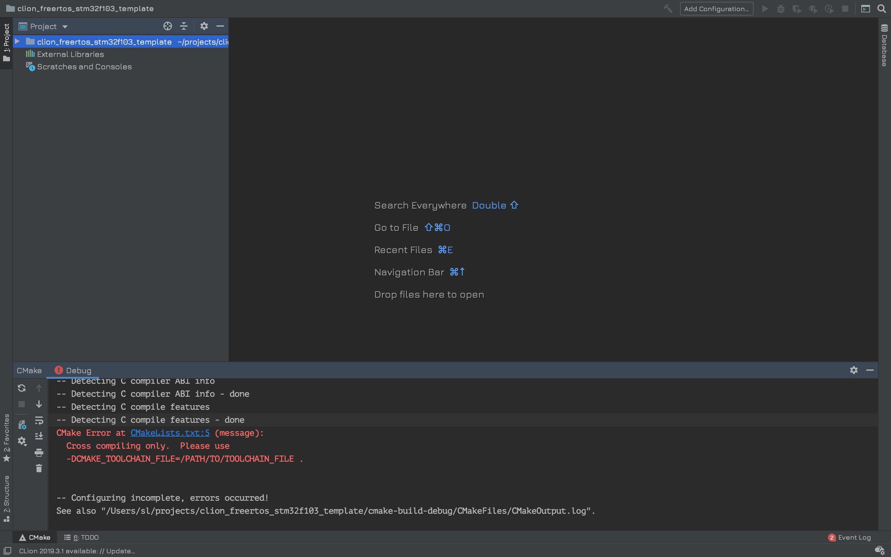
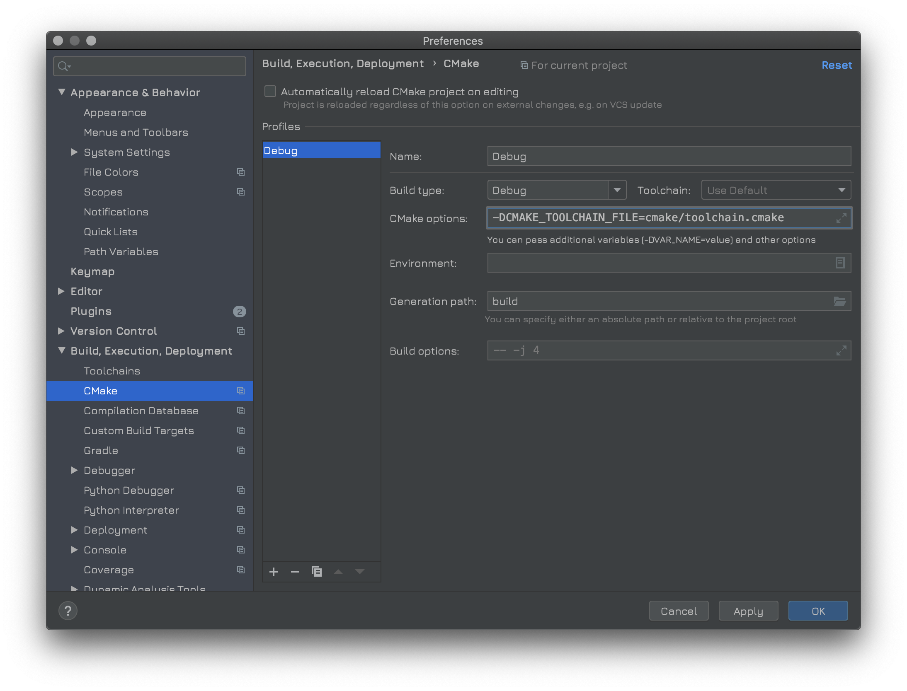

CLion прекрасный инструмент для разработки на C/С++. Но он основан на cmake и у меня возникла проблема при попытке его использования для однокристальных микроконтроллеров stm32F10X (Cortex-M3)

В хоббийных целях, я разработал небольшой проект, который решает следующие задачи:

1. Сборка проекта FreeRTOS (10.2.x) + libopencm3 в cmake
2. Реализация механизма инициализации USB стека 
3. Реализация на базе [1] и [2] модели опроса датчиков температуры DS18B20 и BME280.
4. Управление состоянием.

Целью было получить рациональный с точки зрения размера, быстрый и удобный технологический стек для разных хоббийных задач. 
Мне очень нравится проект libopencm3 за его красоту, лаконичность, точность и элегантность. 

FreeRTOS также является примером очень элегантного кода. Объединив их вместе я получил фундамент для проекта, а сборка под Clion позволила использовать этот прекрасный инструмент разработчика.

Внутрисхемную отладку я осущствляю под blackmagic probe. 

Чтобы нагрузить пример какой-то осмысленной логикой, была выбрана задача опроса большого количества температурных датчиков DS18B20. Это медленная и полная логики операция, которая должна выполняться параллельно с интерфейсом взаимодействия на шине USB.

Чтобы усложнить задачу, параллельно я инициализирую и опрашиваю датчик BME280. Исключение его из проекта не составит никакого труда. Задача была в том, чтобы опрашивать несколько типов датчиков параллельно и реализовывать в это же время интерфейс с пользователем.

В итоге, задачей стало получение элегантного и отзывчивого устройства, которое можно подключить к любому компьютеру и управлять им, взаимодействуя по шине USB посредством программ minicom, putty, etc (в зависимости от типа основной ОС). 

## Способ решения

Для решения этих задач была разработана дополнительно библиотека, способная управлять OneWire протоколом на USART в режиме полудеплекса и построенная поверх библиотека для интерпретации данных от DS18B20, которую можно использовать в FreeRTOS (но можно и без RTOS). Таким образом моё решение позволяет управлять большим количеством устройств на шине с гарантией атомарности операций. Мне не удалось проверить на количествах больше чем 20 датчиков, потому что не удалось найти такое количество датчиков. Но есть мнение, что на одной шине может располагаться ещё несколько десятков устройств без вреда для функциональности и одновреенной обработкой интерфейса USB и решением других задач. Думаю, что теоретический предел составляет около 70+ датчиков на одной шине и определяется их совокупными электрическими характеристиками.

Я выкладываю этот проект на правах свободного использования. Я буду рад, если мой проект кому-либо пригодится.

Хочу отметить, что в настоящий момент активно ищу работу и, если у вас есть проект в котором я могу быть вам полезен, пишите на ....

##  Пример использования

Несколько шагов для получения рабочего примера

### Предварительные условия

У вас должен быть установлен CLion, 

Убедитесь, что у вас установлен `arm-none-eabi-gdb`.

### Настройка

После клонирования проекта, вы увидите что-то в этом роде:



Откройте настройки и выберите папку для сборки. Укажите параметр ```-D CMAKE_TOOLCHAIN_FILE=cmake/toolchain.cmake``` как показано на рисунке



Перейдите в папку проекта и выполните скачивание зависимостей:

`git submodule update --init`

### Сборка проекта

Для того, чтобы проект мог скомпилироваться, предварительно следует собрать библиотеку opencm3. cmake сделаны таким образом, что это является отдельной целью. Таким образом вы единожды собираете библиотеку и потом включаете результат, что значительн ускоряет перекомпиляцию проекта.

Обновите конфигурацию cmake. Вы должны увидеть что-то такое:

```
/Applications/CLion.app/Contents/bin/cmake/mac/bin/cmake -DCMAKE_BUILD_TYPE=Debug -DCMAKE_TOOLCHAIN_FILE=cmake/toolchain.cmake -G "CodeBlocks - Unix Makefiles" /Users/sl/projects/clion_freertos_stm32f103_template
-----------Build Information------------
-- Host    : Darwin
-- Make    : 3.81
-- CC      : GNU 8.3.1
-- CXX     : GNU 8.3.1
-- Build   : Debug
------------Additional Flags------------
-- C   : -mtune=cortex-m3
-- CXX : -mtune=cortex-m3
-- LD  : -Wl,--gc-sections
-- C SPEC : -std=gnu11
-- CXX SPEC  : -std=gnu++14
TOUPPERDebugBUILD_TYPE
-------------Full Flag List-------------
-- C   : -mthumb -mcpu=cortex-m3 -mlittle-endian -mthumb-interwork  -lm -lc -lnosys --specs=nosys.specs  -Wall -Wextra  -mtune=cortex-m3 -std=gnu11 -g 
-- CXX : -mthumb -mcpu=cortex-m3 -mlittle-endian -mthumb-interwork  -lm -lc -lnosys --specs=nosys.specs  -Wall -Wextra  -mtune=cortex-m3 -std=gnu++14 -g 
-- LD  :  -nostartfiles -lc -lnosys --specs=rdimon.specs -Wl,--gc-sections -T /Users/sl/projects/clion_freertos_stm32f103_template/STM32F103C8T6.ld -lopencm3_stm32f1
-- SOURCE FILES : /Users/sl/projects/clion_freertos_stm32f103_template/src/bme280/bme280.c;/Users/sl/project...
freertos_stm32f103_template/src/tools.c;/Users/sl/projects/clion_freertos_stm32f103_template/src/usb/usbcdc.c
-- Configuring done
-- Generating done
-- Build files have been written to: /Users/sl/projects/clion_freertos_stm32f103_template/build

[Finished]
```

После этого собирайте цель libopencm3 (сокращённый вариант):

```
====================[ Build | libopencm3 | Debug ]==============================
/Applications/CLion.app/Contents/bin/cmake/mac/bin/cmake --build /Users/sl/projects/clion_freertos_stm32f103_template/build --target libopencm3 -- -j 4
Scanning dependencies of target libopencm3
  GENHDR  include/libopencm3/stm32/f1/irq.json
  BUILD   lib/stm32/f1
Built target libopencm3

Build finished
```

И можете собирать проект:

```
====================[ Build | stm32f103_freertos.elf | Debug ]==================
/Applications/CLion.app/Contents/bin/cmake/mac/bin/cmake --build /Users/sl/projects/clion_freertos_stm32f103_template/build --target stm32f103_freertos.elf -- -j 4
Scanning dependencies of target freertos
[ 16%] Building C object CMakeFiles/freertos.dir/rtos/portable/GCC/ARM_CM3/port.c.obj
[ 16%] Building C object CMakeFiles/freertos.dir/rtos/event_groups.c.obj
[ 16%] Building C object CMakeFiles/freertos.dir/rtos/croutine.c.obj
[ 16%] Building C object CMakeFiles/freertos.dir/rtos/portable/MemMang/heap_4.c.obj
[ 20%] Building C object CMakeFiles/freertos.dir/rtos/list.c.obj
[ 24%] Building C object CMakeFiles/freertos.dir/rtos/queue.c.obj
[ 28%] Building C object CMakeFiles/freertos.dir/rtos/stream_buffer.c.obj
[ 32%] Building C object CMakeFiles/freertos.dir/rtos/tasks.c.obj
[ 36%] Building C object CMakeFiles/freertos.dir/rtos/timers.c.obj
[ 40%] Linking C static library libfreertos.a
[ 40%] Built target freertos
Scanning dependencies of target stm32f103_freertos.elf
[ 44%] Building C object src/CMakeFiles/stm32f103_freertos.elf.dir/bme280/bme280.c.obj
[ 48%] Building C object src/CMakeFiles/stm32f103_freertos.elf.dir/bme280/bme280_driver.c.obj
[ 56%] Building C object src/CMakeFiles/stm32f103_freertos.elf.dir/libs/getline.c.obj
[ 56%] Building C object src/CMakeFiles/stm32f103_freertos.elf.dir/libs/printf.c.obj
[ 60%] Building C object src/CMakeFiles/stm32f103_freertos.elf.dir/ow/ds18b20.c.obj
[ 64%] Building CXX object src/CMakeFiles/stm32f103_freertos.elf.dir/main.cpp.obj
[ 68%] Building C object src/CMakeFiles/stm32f103_freertos.elf.dir/ow/ow.c.obj
[ 72%] Building C object src/CMakeFiles/stm32f103_freertos.elf.dir/tasks/blink.c.obj
[ 76%] Building C object src/CMakeFiles/stm32f103_freertos.elf.dir/tasks/bme_task.c.obj
[ 80%] Building C object src/CMakeFiles/stm32f103_freertos.elf.dir/tasks/ow_task.c.obj
[ 84%] Building C object src/CMakeFiles/stm32f103_freertos.elf.dir/tasks/stack_overflow_handler.c.obj
[ 88%] Building C object src/CMakeFiles/stm32f103_freertos.elf.dir/tasks/usb_ui.c.obj
[ 92%] Building C object src/CMakeFiles/stm32f103_freertos.elf.dir/tools.c.obj
[ 96%] Building C object src/CMakeFiles/stm32f103_freertos.elf.dir/usb/usbcdc.c.obj
[100%] Linking CXX executable ../stm32f103_freertos.elf
[100%] Built target stm32f103_freertos.elf

Build finished
```

Проект собран. Можно прошивать в контроллер.

В хоббийных целях я использую blackmagic probe. Вы можете воспользоваться тем программатором, который вам больше нравится.

## Структура файлов проекта

Если вы решите использовать части проекта, то эта справка может быть вам полезна.

```
build -- в этой папке собираются все результаты
cmake -- инструкции для cmake
libopencm3 -- библиотека opencm3 
rtos -- FreeRTOS 10.2.x для stm32f1 (Cortex-M3)
	config/FreeRTOSConfig.h -- конфигуарция вашей OS
src -- исходные файлы проекта
	include -- общие заголовки
	libs -- библиотеки общего назначения (getline, printf)
	bme280 -- библиотека и небольшой драйвер для датчика bme280
	ow -- моя библиотека OneWire для атомарных операций на USART
	usb -- реализация стека протокола USB
	tasks -- файлы задач 
    main.cpp 
	tools.c -- процедуры инициализации/использования периферии
```

Несколько замечаний о структуре программы. Несмотря на то, что программа написана на чистом С, я намерено сделал стартовый файл cpp, потому что инициализация C++ значительно сложнее, чем C. Это развязывает руки разработчику для использования С++ библиотек и снижает порог вхождения, в случае необходимости.

Вся программа построена как пример простенького технологического стека и может легко быть адаптирована под ваши задачи. Если вас интересует какая-то особенность сборки, то ищите решение в ./cmake, если в расширении списка исполняющихся задач, то в ./src/tasks  и так далее.

## Пример работы программы

Программа реализуется USBCDC интерфейс. Интерфейс сделан намерено без использования библиотек как машина состояний. Вы можете использовать более сложный подход.

После инициализации вы можете подключиться к интерфейсу в целях опроса шины. Интерфейс работает асинхронно от машины состояний. Подклчение логического анализатора позволяет убедиться в том, что операции производятся "квазипараллельно".


# todo 

1. Перевести README на английский язык
2. Выделить OneWire в состав отдельной библиотеки